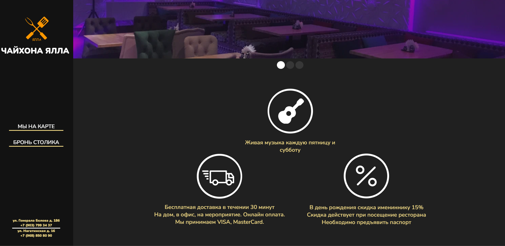
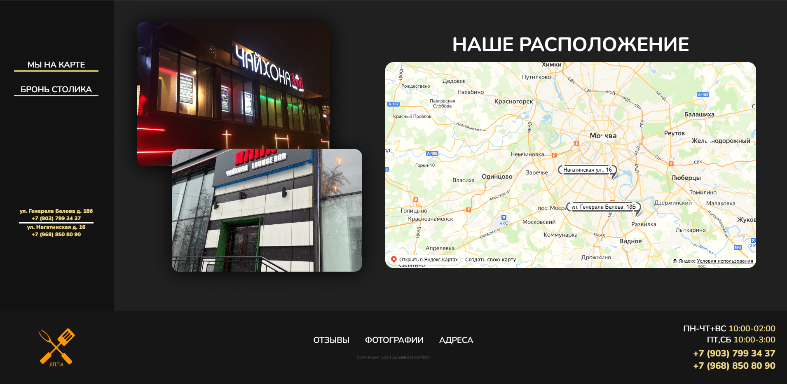

# 🫖 Chaihona — Сайт чайхоны на React 🍵

Добро пожаловать в **Chaihona** — современный сайт для чайхоны, где пользователи могут **просматривать меню, добавлять блюда в корзину и оформлять заказы**. Все заказы мгновенно отправляются в **Telegram-бот** для обработки персоналом 🧾📲


---

## 🌐 Демонстрация
https://yallatest.netlify.app/
---

## 🔥 Особенности

- 📋 **Каталог блюд** — меню с категориями, описанием и ценами  
- 🛒 **Корзина** — пользователь может добавлять и удалять позиции  
- 📤 **Оформление заказа** — форма отправки заказа с контактными данными
- 🗺️Встроен API Яндекс-Карт с отображением адресов ресторанов
- 🤖 **Telegram-уведомления** — заказ мгновенно приходит в чат Telegram-бота  
- 💻 **Адаптивный дизайн** — отлично смотрится и на телефоне, и на компьютере
- ⚛️ **React + Vite** — молниеносная сборка и работа
---

## 📸 Скриншоты




---
## 🚀 Запуск проекта

```bash
# 1. Клонируй репозиторий
git clone https://github.com/Badadsher/chaihona.git

# 2. Перейди в директорию
cd chaihona

# 3. Установи зависимости
npm install

# 4. Запусти проект
npm run dev
